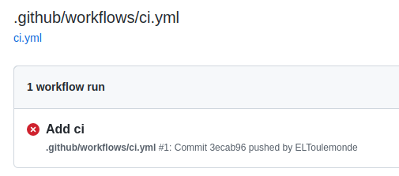

summary: TP4 - Créer une CI GitHub
id: tp4
categories: setup
tags: setup
status: Published
authors: OCTO Technology
Feedback Link: https://github.com/octo-technology/Formation-MLOps-1/issues/new/choose

# TP4 - Créer une CI GitHub

## Vue d'ensemble

Duration: 0:01:00

Pour réaliser ce TP, allez sur la branche `4_start_ci`

```shell
git stash
git checkout 4_start_ci
```

Nouveauté sur cette branche :
- La documentation sphinx est créée.

L'objectif de ce TP est de créer une CI qui valide automatiquement notre code.

## Créer un compte GitHub

Duration: 0:10:00

Vous avez besoin de votre propre compte GitHub pour pouvoir `push` du code et donc éxécuter la ci

1. Créez un compte GitHub (si vous n'en avez pas déjà un)
2. Créez un projet vide
3. Changer l'url de Git en loval
    - Vous pouvez voir votre url actuelle en tapant `git remote -v`.
    - Changez l'url de votre dépôt GitHub avec la commande `git remote set-url origin <<github ssh ou https url>>`
4. Pousser la branche actuelle vers votre dépôt `git push --set-upstream origin 4_start_ci`

Une autre possibilité est de forker notre dépôt (vous devez toujours créer un compte et cliquer sur fork) et de le cloner.

Une fois que c'est fait, allez sur l'interface GitHub dans l'onglet "Actions" vous devriez trouver un fail.



## Corrigez le fichier de CI

Duration: 0:20:00

Dans cette branche vous avez un fichier `.github/workflow/ci.yml`, votre travail est maintenant de compléter ce CI pour valider automatiquement votre code à chaque push.

Votre but est de compléter le fichier pour que votre CI fonctionne et soit vert.

Conseils : Vous devriez le faire étape par étape, pour chaque étape
1. Testez la commande localement dans votre terminal
2. Placez-la dans le fichier `ci.yml`.
3. Poussez votre code pour valider qu'il fonctionne

## Si vous avez fini en avance

Vous pouvez explorer toutes les possibilités avec la [documentation GitHub] (https://docs.github.com/en/actions/automating-builds-and-tests/building-and-testing-python)

## Avant de changer de TP

Duration: 0:02:00

N'oubliez pas de remettre la `remote` à l'état d'origine avec la commande
```shell
git remote set-url origin https://github.com/octo-technology/Formation-MLOps-1.git
```

## Lien vers le TP suivant

Duration: 0:01:00

Les instructions du TP suivant sont [ici](https://octo-technology.github.io/Formation-MLOps-1/tp5#0)